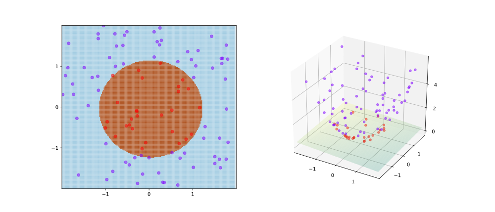

# Introduction

```{r setup,echo=FALSE}
suppressMessages({
suppressPackageStartupMessages({
library(BiocStyle)
library(MLInterfaces)
library(ALL)
library(hgu95av2.db)
options(digits=3)
inst_if_needed = function(p, reponame=p) {
 if (!(p %in% rownames(installed.packages()))) {
  if (p == "BiocManager") install.packages("BiocManager")
  BiocManager::install(reponame, ask=FALSE)
 }
}
})
})
```

## General definition
The [wikipedia entry for "machine learning"](https://en.wikipedia.org/wiki/Machine_learning) reads

<blockquote style="font-size:12px">
Machine learning (ML) is the scientific study of algorithms and statistical models that computer systems use to perform a specific task without using explicit instructions, relying on patterns and inference instead. It is seen as a subset of artificial intelligence. Machine learning algorithms build a mathematical model based on sample data, known as "training data", in order to make predictions or decisions without being explicitly programmed to perform the task.
</blockquote>

This definition is imprecise in many ways, and the phrase "without being explicitly programmed"
is particularly hard to understand.  Our perspective on machine learning focuses on
the possibility of automating interpretation of data.  This is also imprecise, but
helps to expose a few key objectives.

First, the primary aim of statistical science is the production of generic, reusable approaches 
supporting "interpretation of data".  This
underlies the use of statistical procedures and tests 
in specific scientific pursuits such
as biological experimentation or use of economic and behavioral
data in reasoning about public policy. **Machine learning methods
are applications of methods of statistical science to data interpretation.**

Second, one objective of automating data interpretation is
increasing throughput of interpretation processes in a cost-effective
way.  Now that sequencers, microscope imaging tools, and sensors can 
generate data at very high (and increasing) resolution and volume,
manual methods of interpretation based on human perception and
reasoning must be supplemented or replaced by mechanized methods.
**Machine learning methods increase our capacity to perform
statistical data interpretation on extremely large volumes of data.**

Third, a highly attractive objective of automating data interpretation
is elimination of biases, often introduced by human interpreters,
that have cultural, attitudinal, or technical origins.  **Machine
learning methods promise to remove hidden biases from the
process of data interpretation.**

In summary, motivations to study and use methods of machine
learning are driven primarily by the aim of producing
unbiased statistical analyses of burgeoning data volumes.

## Caveats

It must be kept in mind that there are very significant
barriers to achieving aims of useful unbiased interpretation
of vast collections of high-dimensional data as are common
in genomic data science.

- **Limitations of statistical analysis.**  Bradley Efron, a leading statistician
and inventor of a number of highly effective
statistical procedures such as the bootstrap,
remarked: "Statistics is the most successful
information science.  Those who ignore it are condemned to
reinvent it."  Results of centuries of research in 
probability and statistics are available for our
use, but do not lead to consensus on very basic issues
such as measurement and comparison of evidence in
observations.  Another leading statistician, G. E. P. Box,
has remarked "All models are wrong, but some are
more useful than others."  Key problems with
use of simple statistical models include
hidden dependencies among observations,
and incompleteness of data collection.
It turns out to be fairly difficult to obtain
a random sample of a population, but much
of what we hope to accomplish with simple statistics
depends on effective sampling.
- **Data $\neq$ information**.  When properly
implemented, machine learning tools allow us to cost-effectively
"visit" all the records in vast data collections.
At best, this provides two unique sources of value.  First,
traversal of very large samples permits us to produce
estimates of population characteristics that are
highly precise -- averages, for example, will have
very small standard errors.  Second, by surveying
very large collections, we have greater opportunities
to observe "rare" characteristics of population members.
These products of machine learning procedures are
noteworthy, but are often of secondary scientific interest.
- **Garbage in, garbage out.**  The notion that
the mechanistic dimension of machine learning aids
in eliminating biases in data interpretation is
wholly unfounded.  Data selection for algorithm
training, and algorithm structures themselves,
can lead to machine learning processes and
outcomes that are inappropriate for the target
population.  In the domain of natural language
processing, [gender and racial biases were identified
in established procedures for text interpretation](https://arxiv.org/abs/1608.07187).

These are a few of the caveats that should be borne in mind
when considering how machine learning can be employed in genomic data science.

## Basic concepts and examples of machine learning

The following four panel display presents simple machine learning
results for modeling the relationship between outcomes in
acute lymphocytic leukemia.  Briefly, microarray assays
on patients with this disease were assembled in the Bioconductor
package `r Biocpkg("ALL")`.  Two classes of patients
are distinguished: those with a genetic aberration called
BCR/ABL fusion, and those without.  Expression measurements
on two genes, DDR1 and DYRK4, were obtained and plotted in
the plane, colored according to the class of the donor.
For example, the point (DDR1 $\approx$ 8.55, DYRK4 $\approx$ 5.0)
is colored black and corresponds to an individual who is of class "other",
and who does not have the BCR/ABL fusion mutation.
These displays
are based on data from 40 randomly selected patients.

We have labeled the plots with names that may be uninterpretable
to you now.  For the moment, it is sufficient to view these
plots as serving a diagnostic purpose.  Given values for DDR1
and DYRK4 from a patient, plot the point corresponding to these
values on the panel.  If the point is in a green region,
declare BCR/ABL fusion to be present; if the point is in an orange
region, declare the patient to be free of BCR/ABL fusion.
The four panels represent different procedures for coloring
the plane using the same dataset.

```{r doman,echo=FALSE}
data(ALL)
aln = ALL
suppressMessages({
rownames(aln) = make.names(mapIds(hgu95av2.db,keys=rownames(aln), column="SYMBOL", keytype="PROBEID"), unique=TRUE)
})
aln$class = factor(ifelse(aln$mol.biol=="BCR/ABL", "fusion", "other"))
source("myseed.R")
trainInds = sample(1:ncol(aln),40)
set.seed(1234);     rgg <- MLearn(class~., aln[c("DDR1", "DYRK4"),], rpartI, trainInds, minsplit=4)
set.seed(1234);     kgg <- MLearn(class~., aln[c("DDR1", "DYRK4"),], knnI(k=1), trainInds)
set.seed(1234);     ngg <- MLearn(class~., aln[c("DDR1", "DYRK4"),], nnetI, trainInds, 
   size=4, decay=0.01, trace=FALSE)
set.seed(1234);     sgg <- MLearn(class~., aln[c("DDR1", "DYRK4"),], svmI, trainInds)
```
```{r lk4, echo=FALSE,fig.height=6.5,fig.cap="Four learning algorithms for classifying leukemia subtype using expression of two genes.  Points are training data, region color at (x,y) is prediction of class for patient bearing expression values (x,y)."}
par(mfrow=c(2,2), mar=c(4,4,2,1))
planarPlot(rgg, aln[c("DDR1", "DYRK4"),], "class")
title("(a) rpart")
trx = exprs(aln)["DDR1",trainInds]
trz = exprs(aln)["DYRK4",trainInds]
trcol = ifelse(aln$class[trainInds]=="fusion", "yellow", "black")
points(trx, trz, col=trcol, pch=16)
legend(8.5,7.1,pch=c(16,16), col=c("yellow", "black"), legend=c("fusion", "other"), bg="transparent")
pal = c("#66C2A5", "#FC8D62", "#8DA0CB", "#E78AC3", "#A6D854", "#FFD92F", "#E5C494", "#B3B3B3")
legend(6.0,5.6,fill=pal[1:2],legend=c("pred. fusion", "pred. other"), bg="transparent")
planarPlot(kgg, aln[c("DDR1", "DYRK4"),], "class")
points(trx, trz, col=trcol, pch=16)
title("(b) 1-nn")
planarPlot(ngg, aln[c("DDR1", "DYRK4"),], "class")
points(trx, trz, col=trcol, pch=16)
title("(c) nnet, size=4, decay=.01")
planarPlot(sgg, aln[c("DDR1", "DYRK4"),], "class")
points(trx, trz, col=trcol, pch=16)
title("(d) svm")
```


Each plot presents the same configuration of yellow and black
data points, but the coloring of the background varies from
plot to plot.  Each (x,y) point in the plane is colored peach if the
learning method predicts that individuals with x as their
DDR1 expression value, and y as their DYRK4 value, are of the
"other class".  The point (x,y) is colored light green if the individual with expression
values (x=DDR1, y=DYRK4) has the BCR/ABL fusion.  Thus, even
though no data points are available at (x,y) = (9.0, 5.0),
all the procedures predict that individuals with that
expression configuration are BCR/ABL fusion-free.

### Exercises on comparing two-class, two-feature prediction applications

1. Which plot in Figure 1 exhibits the smallest number of training sample misclassification?  a b c d
2. Which statement is true?  Based on the training data: 
- i) prediction regions for neural network and support vector machine have different geometric
structures but perform identically with respect to misclassification
- ii) the 1-nn procedure misclassifies a single "other" event
- iii) the neural network and support vector machine procedures produced equal
numbers of misclassifications of patients presenting with BCR/ABL fusion 
- iv) the neural network and support vector machine procedures produced equal
numbers of misclassifications of patients presenting without BCR/ABL fusion 
3. True or false: All procedures agree that a patient presenting with DDR1 = 7.7 and
DYRK4 = 6.0 should be classified as positive for BCR/ABL fusion.

### Dimension reduction and feature engineering

For concreteness, our examples deal with bivariate features (DDR1, DYRK4).
Machine learning techniques have arisen for the purpose of dealing
with many thousands of features measured on every sample.  Dimension
reduction addresses the fact that the features themselves, measured
in their own idiosyncratic scales, may be transformed and combined
to help extract information of greater interest.

We can use methods of matrix algebra to define some of the key
approaches to dimension reduction and feature engineering of
interest in genomic data science.  We use expression measures
on $p$ genes, obtained for $N$ individuals, 
to form the columns of a matrix $X$.  The singular
value decomposition of a rank $p$ matrix $X$ with real-valued
entries is the factorization $X = UDV^t$,
where $U$ is $N \times p$ orthonormal, $D$ is diagonal $p \times p$ with positive diagonal elements,
with $D_{ii}$ the vector of eigenvalues, and $V$ is orthonormal $p \times p$.
The factors are organized so that the entries of $D$ are in increasing magnitude.
The columns of $UD$ are called the principal components (PCs) of $X$. 
They are uncorrelated, and the first principal component (PC1) is the
linear combination of columns of $X$ possessing maximum variance
among all possible linear combinations.  The second PC is the
linear combination of columns of $X$ possessing maximum variance among
all those linear combinations uncorrelated with PC1. Further PCs
are obtained similarly.

For concreteness, we consider $p=5$ genes from the ALL data.  First
we present pairwise scatterplots.

```{r domomo,echo=FALSE,fig.cap="Pairwise scatterplots for five genes"}
inter = c("SRGN", "CD63", "NAMPT", "CSTA", "ZYX")
myd = exprs(aln[inter,])
myd=t(myd)
pc = prcomp(myd)
pairs(myd)
```

Clearly there are correlations between expression measures
on several genes.  A principal components
reduction of the multivariate expression patterns
to two dimensions is shown in the next display, which
is called a biplot.  The red arrows show how individual
features contribute to the positioning of samples
in the PC plane.  Arrows for genes that point in the same
or approximately same direction
indicate that the genes have positively correlated expression values;
arrows pointing in opposite directions correspond to negatively
correlated genes.

```{r dobip2,echo=FALSE,fig.cap="Biplot for the PCA of the five gene extract for ALL"}
biplot(pc, xlabs=ifelse(aln$class=="fusion", "+", "-"), cex=c(1,.6), expand=.9, choices=1:2)
legend(5,17,pch=c("+", "-"), legend=c("fusion", "other"))
```

It is reasonable to say that we've used the data to "engineer"
new features from the measured features by a) selecting features
of interest, b) using a feature combination procedure (PCA), and
c) presenting a selection of the new features (PC1 and PC2; there are
in this example 5 PCs to choose from).

Important applications of feature engineering related to principal component
analysis include creation of vectors used to correct for population
stratification in genome-wide association studies, and identification
of [batch effects](https://www.nature.com/articles/nrg2825.pdf) 
in various types of genome-wide molecular assay.

### Exercises on correlation and dimension reduction for multivariate data

1. Run the following code
```
inst_if_needed = function(p, reponame=p) {
 if (!(p %in% rownames(installed.packages()))) {
  if (p == "BiocManager") install.packages("BiocManager")
  BiocManager::install(reponame, ask=FALSE)
 }
}
inst_if_needed("BiocManager")
inst_if_needed("ALL")
inst_if_needed("hgu95av2.db")
inst_if_needed("AnnotationDbi")
inst_if_needed("edxAdvBioc", "vjcitn/edx_adv_bioc")
library(ALL)
library(hgu95av2.db)
library(AnnotationDbi)
data(ALL)
rownames(ALL) = make.names(mapIds(hgu95av2.db,keys=rownames(ALL), 
   column="SYMBOL", keytype="PROBEID"), unique=TRUE)
```
We compute the correlation between two genes, say SRGN and ZYX, in the ALL
dataset via
```
an = as.numeric
cor(an(exprs(ALL["SRGN",])), an(exprs(ALL["ZYX",])))
```
Over all available patients, what is the correlation between CD63 and ZYX?

2. Run the following code.
```
isFus = which(ALL$mol.biol == "BCR/ABL")
cor(an(exprs(ALL["SRGN",isFus])), an(exprs(ALL["ZYX",isFus])))
```
What is the value of the correlation coefficient relating SRGN expression
to ZYX expression in patients **lacking** the fusion mutation?

3. To obtain a correlation matrix, use
```
options(digits=3)
cor(t(exprs(ALL[c("SRGN", "ZYX", "CD63"),])))
```
Compare correlation matrices obtained for patients with BCR/ABL
fusion to those obtained for patients without the fusion.  Which
pair of genes exhibits the greatest difference?

4. We can use `r Biocpkg("KEGGREST")` to obtain information related to ALL.  KEGG
stands for the Kyoto Encyclopedia of Genes and Genomes, and KEGGREST
provides functions that interrogate the encyclopedia.  We will find
the code for one subtype of ALL, will then find a code for a leukemia-related
pathway, and then obtain a set of genes annotated to the pathway.
```
inst_if_needed("KEGGREST")
library(KEGGREST)
keggFind("disease", "leukemia")[1]  # there are several hits
keggGet("ds:H00001")[[1]]$PATHWAY  # the pathway id
names(keggGet("hsa05202")[[1]])    # all fields for pathway
keggGet("hsa05202")[[1]]$GENE[1:8] # a sample of GENE records
```
Perusal of the gene list for this pathway leads to the
following extract and displays of ALL-relevant gene expression
patterns.

```{r rename2,echo=FALSE}
data(ALL)
suppressMessages({
rownames(ALL) = make.names(mapIds(hgu95av2.db,keys=rownames(ALL), 
   column="SYMBOL", keytype="PROBEID"), unique=TRUE)
})
#biplot(prcomp(scale(emat)), 
#   xlabs=ifelse(ALL$mol.biol=="BCR/ABL", "+", "-"), cex=c(1,.6))
```

```{r dobip3}
emat = t(exprs(ALL[c("RUNX1", "CSF1R", "MPO", "CSF2", 
   "IL3", "RUNX1T1", "BCR", "ABL1"),]))
```

Which statement is consistent with the pair of biplots shown here?

- The correlation between BCR and ABL1 is stronger in fusion-negative samples.
- The correlation between MPO and CSF1R is positive in fusion-negative samples and
becomes negative in fusion-positive samples.
- The correlation structure of gene expression does not change between the
two groups of patients.

```{r lk2b,echo=FALSE, fig.cap="Stratified biplots for ALL data.", fig.height=5}
par(mfrow=c(1,2))
isFus = which(ALL$mol.biol == "BCR/ABL")
biplot(prcomp(scale(emat[-isFus,])), 
   xlabs=ifelse(ALL[,-isFus]$mol.biol=="BCR/ABL", "+", "-"), cex=c(1,.6), expand=.9)
title("Fusion negative")
biplot(prcomp(scale(emat[isFus,])), 
   xlabs=ifelse(ALL[,isFus]$mol.biol=="BCR/ABL", "+", "-"), cex=c(1,.6))
title("Fusion positive")
```


### Concepts of generalization error and sample splitting

The process that leads to coloring the planes in Figure 1 
an illustration of **generalization** in machine learning.  Specifically,
even though our data there consisted of 40 pairs of measurements on DDR1 and DYRK4,
we colored every point in the plane $\{(x,y)| 6.0 \leq x \leq 9.2 ~ \& ~ 4.9 \leq y \leq 7.2\}$,
and, in fact, we can produce predictions far outside this limited set.
The generalization consists in the assertion that any ALL patient with
DDR1 value $x$ and DYRK4 value $y$ is predicted to have fusion or not
depending on the color of the subregion of the plane at $(x,y)$.

An important goal of machine learning is reduction in
the rate of **generalization errors**, which occur
when the class that we assign 
differs from the actual class of the contributing patient.  We can estimate the
generalization rate by using test data not used in the construction
of the model underlying the learner.  Much of the success of modern
machine-learning based AI is due to the availability of substantial
quantities of data that are representative of data to be
encountered in applications.  Learning procedures are iteratively
tuned to improve generalization performance.

Two concepts of **sample-splitting** are relevant to understanding
how accuracies of machine learning procedures are estimated. 

- **Test vs. train.**  The available data are split into
a training set and a test set.  Machine learning is used with the training
set, and the test set is used to estimate the rate of generalization error.
- **Cross-validation.** Several realizations of split data are formed, with
learning and generalization error rate estimation performed for
each split.  A final error rate is computed by averaging over the
series of splits.  Leave-one-out cross-validation consists of $N$
steps for a dataset of size $N$.  The training set for step $i = 1, \ldots, N$
omits the $i$th element.  The estimated generalization error rate 
is the number of erroneous predictions for each left-out element divided by $N$.
In k-fold cross validation, the data are partitioned into $k$ subsets,
and the $i$th training event, $i = 1, \ldots, k$, uses the data excluding
the $i$th subset.  Each subset will have approximately $N/k$ observations,
and each training event uses $(k-1)N/k$ observations to make predictions
for the left-out observations.  The generalization error rate is the
average of error rates obtained over the $i$ training events.

We will now look at a number of machine learning procedures
in greater detail.

### Linear discriminant analysis

Our data on gene expression can be formalized as follows.  The patients
with the fusion mutation form a class with mean expression vector $\mu_1$
and covariance matrix $\Sigma_1$.  The patients without the mutation
form the class with mean $\mu_2$ and covariance matrix $\Sigma_2$.
We want to use the available expression data to produce predictions for new
patients that are accurate.  In 1938 Fisher proposed a procedure based
on the quantity $w = (\Sigma_1 + \Sigma_2)^{-1}(\mu_2 - \mu_1)$, which can
be shown to maximize the ratio of the between-class variation to
the within-class variation.  $w$ is a vector perpendicular to a plane
that optimally separates the classes, and this plane is used to
form prediction regions.  Justifications and extensions of this
procedure are available in the [wikipedia entry](https://en.wikipedia.org/wiki/Linear_discriminant_analysis).

For the two-class problem it is easy to use linear regression to
produce the linear discriminant.  Classes are coded -1/1 and this
coding is used as the response.  In exercises we will work through this procedure
for coloring the plane as we do in Figure 1 for other procedures.


### rpart: recursive partitioning

Recursive partitioning (also known as "CART", for
classification and regression trees) is a machine learning procedure
with a long history.  Details about the algorithm are given
in a very useful [vignette](https://cran.r-project.org/web/packages/rpart/vignettes/longintro.pdf).
Briefly, we are given the values $x_i$ of set of $p$ variables measured on individual $i$, $i = 1, \ldots, N$,
and a class label $c_i$ for each individual.

From the package vignette by Therneau and Atkinson, we have the following
characterization of the algorithm for creating trees.
"The tree is built by the following process: first the single variable is found which best
splits the data into two groups.... The data is separated, and
then this process is applied separately to each sub-group, and so on recursively until the
subgroups either reach a minimum size (5 for this data) or until no improvement can be
made."

The tree leading to Figure 1(a) is

```{r doag,fig.height=6.5,fig.cap="Fitted tree for Figure 1(a).",echo=FALSE}
plot(rgg@RObject)
text(rgg@RObject)
```

We read this plot by "going left" when the condition at a branch point is met.
We can use this rule to understand the left-most leaf of the tree (fusion) and
the light green-colored region at the top center of the rpart panel.  We start at the top
with DDR1 $\geq$ 7.287, move left and find a new branch wit DDR $<$ 7.987.
Continuing to the left, we are now in the interval 7.287 $<$ DDR $<$ 7.287,
and if we continue to the left and assert DYRK $\geq$ 6.461, we move to the
left and end at 'fusion'.

A report on the trained tree is
```{r lkzzz,echo=FALSE}
RObject(rgg)
```

A significant generalization of recursive partitioning is the random forests
algorithm, which computes large numbers of trees using randomly selected 
subsets of the data and randomly selected subsets of features to use.
The resampling process reduces the risk of tailoring the predictions too
finely to the data at hand.


### k-nearest neighbors

$k$-nearest neighbors is well described in the 
associated [wikipedia entry](https://en.wikipedia.org/wiki/K-nearest_neighbors_algorithm).
We note the geometrically complex boundary of the prediction regions in Figure 1(b).

### Feed-forward neural network

Figure 3 gives a view of the model underlying Figure 1(c).  We specified
that there are four "hidden units".  A "bias weight" is estimated for each
of those, and for the prediction unit.  Weights are also assigned to the inputs.
```{r lkpl,echo=FALSE,fig.cap="The layout of the neural network underlying Figure 1(c)."}
inst_if_needed("edxAdvBioc", "vjcitn/edx_adv_bioc")
library(edxAdvBioc) # does not match repo name but OK
plot(RObject(ngg))
```

The numerical values of the weights are given in the summary report for `nnet`:
```{r klkklklm,echo=FALSE}
summary(RObject(ngg))
```

Modern neural network methods permit more complicated network architectures and use
stronger methods of optimization to choose weights that minimize training
errors and have good generalization properties.

### Support vector machines

Figure 1(d) illustrates a situation where representatives of one
class live "in the middle" of the feature space, qualitatively
surrounded by members of the other class.  This is a situation
in which projection of the data into a higher dimensional space
can help define a hyperplane that separates the classes.  An
illustration of this process from the Wikipedia
entry for the [Kernel method](https://en.wikipedia.org/wiki/Kernel_method)
gives the basic idea.



In two dimensions, there is no linear function that will separate the
red from blue points.  But in the transformation from $(x,y)$ to $(x,y,x^2+y^2)$,
the red points
are pushed to larger values in the third (vertical) dimension.  A separating hyperplane
can then be found using linear discriminant analysis with the three variables.
A distinctive feature of support vector machine algorithms is their emphasis
on choosing the separating hyperplane that produces the largest gap (also called margin) between
classes.

### Exercises on linear discriminant analysis (LDA)

We'll use a balanced subset of the ALL data here.
```{r dolda1}
kpf = c(39L, 10L, 83L, 23L, 30L, 20L, 51L, 22L, 35L, 11L, 78L, 87L, 
15L, 43L, 94L, 77L, 32L, 58L, 19L, 85L)
kpn = c(108L, 55L, 37L, 52L, 119L, 113L, 124L, 123L, 106L, 12L, 122L, 
82L, 24L, 28L, 116L, 89L, 84L, 46L, 90L, 114L)
ALL.l = ALL[, sort(c(kpf,kpn))]
ALL.l$class = ifelse(ALL.l$mol.biol == "BCR/ABL", "fusion", "other")
```

There are direct implementations of LDA but for the two class
problem with equal class numbers it is easy to 
produce the standard linear discriminant using linear regression.

Here are the class labels.
```{r dolda2}
ncl = ifelse(ALL.l$class == "fusion", 1, -1) 
table(ncl)
```
Now we set up a data.frame with the expression data, and
a fine grid `nd` to color the plane with our predictions.
```{r doldladl}
dd = data.frame(ddr1=as.numeric(exprs(ALL.l["DDR1",])), 
  dyrk4=as.numeric(exprs(ALL.l["DYRK4",])), ncl=ncl)
nd = expand.grid(i=1, ddr1=seq(6,9.1,.01),  # for plotting
  dyrk4=seq(4.9, 7.2,.01))
```
The fitted regression:
```{r doreere}
litm = lm(ncl~., data=dd)
summary(litm)
```
The model we've fit has the form $$L = a + bx + cy + e$$ where $L$
is our class label coded to $(-1,1)$, $x$ is our DDR1 measure, $y$ is
our DYRK4 measure, and $e$ is our mean zero residual.  The linear
discriminant is the line in the $(x,y)$ plane where the fitted
value of $L$ changes sign.

Here is the display of the data in the plane colored according
to the LDA predictions, using the condition `prs>0` below.
```{r dochs}
prs = predict(litm, nd)
plot(dyrk4~ddr1, data=nd, col=c("#66C2A5", "#FC8D62")[factor(prs>0)], pch=19)
points(dd$ddr1, dd$dyrk4, col=factor(ncl), pch=19)
```

1. Our regression gives estimates for $(a, b, c)$ in the equation for $L$
above, and we will use $$0 = -5.6102 + 0.7868\cdot\mbox{DDR1} -0.0372\cdot\mbox{DYRK4}$$ as
our definition of where the fitted value of $L$ changes sign.  If we
rewrite this equation so that it has the form $\mbox{DYRK4} = m\cdot \mbox{DDR1} + s$,
what is the value of $m$?
1. What is the value of $s$?
1. It is fairly easy to see that the green region could be extended by
tilting the boundary a little to "rescue" two black points, and thus
reduce the overall number of misclassifications.  Add the line
$y = -54.75 + 8.11 x$ to the display just computed to demonstrate this.  
What function should be used to add the line?

Conclude
that LDA does not necessarily find a linear boundary to **minimize misclassification
errors**.  The actual objective of LDA is to find the
equation of a plane that is perpendicular to the vector along which the
distance between the means of the two groups is maximized, taking into account
the variation within these groups.

### Exercises on estimating generalization error

To reduce the amount of code we need to write, we use some
functions from the `r Biocpkg("MLInterfaces")` package without
going into details.

The tree that we worked with in Figures 1 and 5 was computed on
a training set of 40 observations as follows.
```{r dodoadad}
library(MLInterfaces)
trainInds = c(13L, 117L, 72L, 79L, 17L, 71L, 96L, 47L, 60L, 57L, 67L, 78L, 
50L, 113L, 87L, 29L, 27L, 1L, 107L, 14L, 120L, 30L, 76L, 62L, 
105L, 21L, 39L, 25L, 61L, 49L, 69L, 75L, 58L, 48L, 42L, 109L, 
95L, 59L, 98L, 3L)
ALL$class = ifelse(ALL$mol.biol == "BCR/ABL", "fusion", "other")
rgg <- MLearn(class~., ALL[c("DDR1", "DYRK4"),], rpartI, trainInds, minsplit=4)
RObject(rgg)
```
We compute the confusion matrix for the 88 left-out samples.  This
is just the cross-tabulation of the predicted class against the known class.
```{r lkconfu}
confuMat(rgg)
```
Exercises.

1. What is the test-set misclassification rate estimate?
2. We introduce a new set of features to try.
```{r donewset}
newg = c("RUNX1", "CSF1R", "MPO", "CSF2", "IL3", "RUNX1T1", "BCR", "ABL1")
rgg2 <- MLearn(class~., ALL[newg,], rpartI, trainInds, minsplit=4)
confuMat(rgg2)
```
What is the new misclassification rate estimate?

3. Let's reduce the depth of the tree by increasing the `minsplit` parameter.
```{r donewset2}
rgg3 <- MLearn(class~., ALL[newg,], rpartI, trainInds, minsplit=5)
RObject(rgg3)
confuMat(rgg3)
rgg4 <- MLearn(class~., ALL[newg,], rpartI, trainInds, minsplit=7)
RObject(rgg4)
confuMat(rgg4)
```
We see that the test-set based misclassification rate decreases as we
simplify the tree.  But for a different choice of training/test split,
we might not see such a nice sequence.  

Let's do some programming to produce a cross-validated estimate of
the misclassification rate for the two settings of minsplit. We'll do
five-fold cross validation, training on 4/5 of the data and testing
on the remaining fifth.  This can be done five times.  The splits
will be formed using chunks of a random permutation of indices.
```{r asdasda}
inst_if_needed("BBmisc") # for chunk
library(BBmisc)
set.seed(1234)
basic = sample(1:128, size=128) # permute the simple indices
ch = chunk(basic, n.chunks=5)   # chop into five groups
confus_5 = vector("list", 5)    # prepare for confusion matrices
confus_7 = vector("list", 5)
for (i in 1:5) {
 trainInds = setdiff(basic, ch[[i]])
 confus_5[[i]] = confuMat(MLearn(class~., ALL[newg,], rpartI, trainInds, minsplit=5))
 confus_7[[i]] = confuMat(MLearn(class~., ALL[newg,], rpartI, trainInds, minsplit=7))
}
mcr = function(x) 1-(sum(diag(x))/sum(x))
mcr.5 = mean(sapply(confus_5, mcr))
print(mcr.5)
```
What is the average misclassification rate for the procedure with minsplit set to 7? 

4. Repeat the cross-validation loop substituting nnetI for rpartI, and comparing
rates for networks of sizes 4 and 3, with decay parameter set to 0.01 for both sizes.
Your code should look like
```
confus_4 = vector("list", 5)    # prepare for confusion matrices
confus_3 = vector("list", 5)
set.seed(1234) # because nnet may have a random start
for (i in 1:5) {
 trainInds = setdiff(basic, ch[[i]])
 confus_4[[i]] = confuMat(MLearn(class~., ALL[newg,], nnetI, trainInds, size=4, decay=.01, maxit=1000))
 confus_3[[i]] = confuMat(MLearn(class~., ALL[newg,], nnetI, trainInds, size=3, decay=.01, maxit=1000))
}
mean(sapply(confus_4, mcr))
mean(sapply(confus_3, mcr))
```
Are the results better for the smaller model?


# mlr3 applied to Golub's 1999 leukemia study

Our objective here is to use a machine learning framework
for R with gene expression data assembled in leukemia studies.
We'll start with some older microarray data and
check whether the findings are compatible with analyses
using more recent RNA-seq studies.

The source is
```
Molecular Classification of Cancer: Class Discovery and Class
     Prediction by Gene Expression Monitoring, Science, 531-537, 1999,
     T. R. Golub and D. K. Slonim and P. Tamayo and C. Huard and M.
     Gaasenbeek and J. P. Mesirov and H. Coller and M.L. Loh and J. R.
     Downing and M. A. Caligiuri and C. D. Bloomfield and E. S. Lander
```

## Transform Expression Data to data.frame

Bioconductor's `golubEsets` package provides
ExpressionSet instances of the training and test
data from this paper.

Here we obtain the training data and convert to SummarizedExperiment format.

```{r get1}
suppressMessages({
suppressPackageStartupMessages({
library(golubEsets)
library(SummarizedExperiment)
})
})
data(Golub_Train)
Golub_Train
goltr = as(Golub_Train, "SummarizedExperiment")
```
The expression measures were recorded as integers and
we convert them to double precision here, as
most statistical procedures will assume this
representation.
```{r dodf}
tmp = assay(goltr)
class(tmp[1,1])
tmp[] = as.double(tmp[])
assay(goltr) = tmp
goltr
```

We will use the expression data to predict
the form of leukemia.  AML is used to denote
acute myelogenous leukemia, ALL is for
acute lymphocytic leukemia.
```{r get2}
table(goltr$ALL.AML)
```

Now, **to simplify use of the `mlr3` package**, we
convert the assay data to a data.frame.  (In general
we do not want to do this, and later on we will
indicate how we can retain the SummarizedExperiment
structure for use in mlr3-based learning pipelines.)

We'll add "Class" at the final column
to hold our class variable.

```{r dodf2}
goltrdf = data.frame(t(assay(goltr)), Class=goltr$ALL.AML)
dim(goltrdf)
```

## Use mlr3 structures

`mlr3` is really an ecosystem of packages devoted
to modernizing machine learning in R.  Users

- define `Tasks`, which consist mainly of identifying
feature data and prediction targets
- a process related to task definition is `Filtering`,
and procedures for ordering features are provided
- specify `Learners`, which are really classes of
algorithms for predicting some feature values on the
basis of others, or for characterizing structures in
the data on the basis of patterns identified among features
- execute learning processes

## Task setup

First we set up the 'task' of predicting
ALL vs AML with all the features.
```{r donew}
library(mlr3)
library(mlr3learners)
t1 = TaskClassif$new("myl1", goltrdf, "Class")
class(t1)
```

This has all available features.  We will introduce a filtering step
to reduce the feature set, just below.

### Set up a test task


We will also create a task that can be used to
assess results of learning, based on data left
out of the training process.

```{r dote}
data(Golub_Test)
golte = as(Golub_Test, "SummarizedExperiment")
tmp = assay(golte)
class(tmp[1,1])
tmp[] = as.double(tmp[])
assay(golte) = tmp
goltedf = data.frame(t(assay(golte)), Class=golte$ALL.AML)
t2 = TaskClassif$new("myt1", goltedf, "Class")
```

### Filtering features using variation across samples

A very simple approach to ordering features with respect
to utility for prediction ranks them according to
variation across samples.  The idea is that a feature
showing no variation would be completely useless.  A
caveat is that variation due to the presence of data
errors and outliers should not be highly valued, but
could be under this simple rubric.
More subtle approaches are available and will
be explored in exercises.

We'll retain
the top 500 features in this variance-based ranking.

```{r doffff}
library(mlr3filters)
NFEAT = 500 
filter = flt("variance")
filter$calculate(t1, nfeat=NFEAT)
dim(as.data.table(filter))
as.data.frame(as.data.table(filter))[1:5,]
kp = as.data.frame(as.data.table(filter))$feature[1:NFEAT]
```

### Select the random forests learner

The options for learners can be seen with
`mlr_learners`:
```{r lkrn}
mlr_learners
```

Here we define the task using the filtered features in the training
set.  We'll then use `classif.ranger` to train a random
forests learner.  We'll ask that variable importance
be recorded, using the 'impurity' metric.

```{r dorange}
t1f = TaskClassif$new("myrf", goltrdf[, c(kp, "Class")], "Class")
class(t1f)
l1 = lrn("classif.ranger", importance="impurity")
set.seed(1234) # for random forests
l1$train(t1f)
l1$model
```

The confusion matrix for prediction on the 'left out' data is:
```{r thecon}
ll = l1$predict(t2)
aa = as.data.frame(as.data.table(ll))
table(aa[,2], aa[,3])
```

Note the out-of-bag estimate of accuracy, which is based
on the training data.  Because the random forest learner
does internal training with resampling, we _could_ legitimately use
`Golub_Merge` for our analysis and will do so in exercises.

## Retrieving and assessing a 'signature' from the variable importance measures

The probe IDs for the top 20 genes as recorded in
the random forests application are:
```{r wkip}
library(ranger) # for importance()
top20 = names(tail(sort(ranger::importance(l1$model)),20))
top20
```
There's a little glitch in the name processing.
```{r lkgli}
library(hu6800.db)
top20 = gsub("\\.", "-", top20)
all(top20 %in% keys(hu6800.db))
```
We can decode these to gene symbols as follows:
```{r dolib}
library(hu6800.db)
signat = mapIds(hu6800.db, keys=top20, column="SYMBOL", keytype="PROBEID")
signat
```
We'll use the merged data.  First we check the pairwise
scatterplot for four genes.
```{r lklkk}
data(Golub_Merge)
mat = exprs(Golub_Merge[top20,])
rownames(mat) = signat
class = Golub_Merge$ALL.AML
pairs(t(mat[17:20,]), col=factor(class))
```
Now we use PCA and biplots to look for
structure.
```{r dobip}
pp = prcomp(t(mat), scale=TRUE)
par(mfrow=c(1,2))
plot(pp$x[,1:2], col=factor(class))
plot(pp$x[,2:3], col=factor(class))
legend(2,-2,col=1:2,legend=levels(factor(class)), pch=c(1,1))
par(mfrow=c(1,2))
biplot(pp)
biplot(pp, 2:3)
```

The points are projections of the expression data
for individuals into principal components space -- on
the left, PC2 is plotted against PC1, and on the right,
PC3 is plotted against PC3.  The right hand plot
suggests that expression variation in samples may be structured
with three 
Could this be suggestive of AML subtypes?  Let's explore in TCGA.

# Working with TCGA LAML data

## Data acquisition for one assay on one tumor type

`curatedTCGAData` uses ExperimentHub to simplify repeated
usage of TCGA data.

```{r gettcda,cache=TRUE}
suppressMessages({
library(curatedTCGAData)
laml = curatedTCGAData("LAML", "RNASeq2GeneNorm", dry.run=FALSE)
})
laml
```

This data structure is convenient for grouping multiple assays.
We can simplify to a single SummarizedExperiment as we are
focusing on expression.
```{r dosimp}
library(MultiAssayExperiment)
e1 = experiments(laml)[[1]]
colData(e1) = colData(laml)
e1
```

## Subsetting to genes of interest; PCA and biplot

We'll use our microarray-derived signature to extract 
`r length(intersect(signat, rownames(e1)))`
genes for exploration.


```{r getint,fig.height=7,fig.width=7}
comm = intersect(signat, rownames(e1))
rr = assay(e1[comm,])
ppseq = prcomp(t(rr), scale=TRUE)
biplot(ppseq,expand=.9,cex=c(1.3,.8),xlabs=rep(".",nrow(ppseq$x)))
```
We see some indication of a subgroup defined by higher expression
of ELANE, and another defined by  higher expression of CTSD.

## Survival analysis

The survival data are not in great shape.  We'll have to subset
to individuals with putatively interpretable information.


```{r dosur}
library(survival)
e1s = e1[,!is.na(e1$vital_status)|e1$days_to_death>0]
obstime = apply(cbind(e1$days_to_death, e1$days_to_last_followup),1,function(x)max(x, na.rm=TRUE))
obstime[!is.finite(obstime)] = NA
sf = survfit(Surv(obstime, e1s$vital_status)~I(as.numeric(assay(e1s["ELANE",]))>1280))
sf
plot(sf, lty=1:2)
cc = coxph(Surv(obstime, e1s$vital_status)~I(as.numeric(assay(e1s["ELANE",]))>1280))
summary(cc)
```

# Simplifying translation from SE to mlr3

```{r doclust}
inst_if_needed("edxAdvBioc", "vjcitn/edx_adv_bioc")
library(edxAdvBioc)
fall_golub = se_to_filtered_task(taskid='f1', se=goltr, "ALL.AML")
fall_tcga = se_to_filtered_task(taskid='f2', se=e1, tmaker=mlr3cluster::TaskClust)
```
